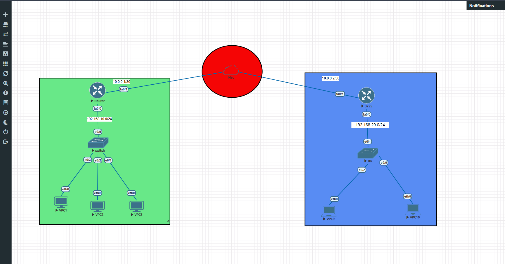
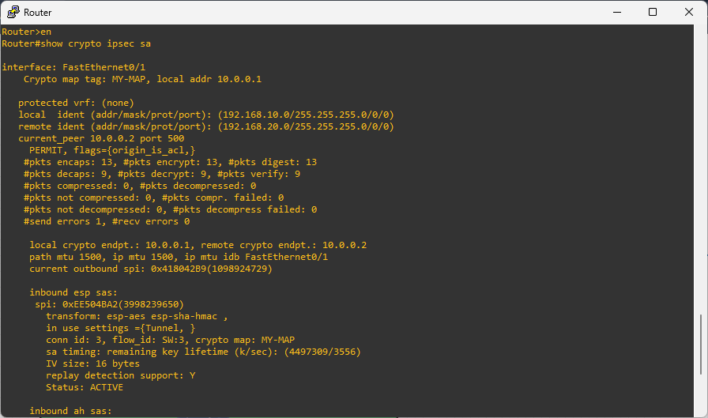

##  Cisco Site-to-Site IPsec VPN Architecture

## 📌 Overview

This project demonstrates the design and implementation of a secure Site-to-Site IPsec VPN connecting two remote enterprise sites (Branch A and Branch B) over a simulated public Internet backbone using Cisco routers. 
The primary goal is to establish an encrypted tunnel using IKEv1 (Phase 1 & Phase 2) to ensure Data Confidentiality, Integrity, and Authentication for all cross-site traffic.
---
## 📐 Network Topology
* Branch A (Green Zone): LAN 192.168.10.0/24 | WAN Interface IP 10.0.0.1/30
* Branch B (Blue Zone): LAN 192.168.20.0/24 | WAN Interface IP 10.0.0.2/30
* WAN / Internet Core: Simulated ISP WAN connectivity.
---


## 🔐 Cryptographic & Security Specifications

| Parameter | Configuration / Algorithm |
| :--- | :--- |
| IKE Version | IKEv1 |
| Phase 1 Encryption | AES-128 / AES-256 |
| Phase 1 Authentication | Pre-Shared Key (PSK) |
| Diffie-Hellman Group | Group 2 (1024-bit) |
| Phase 2 Transform-Set | ESP-AES + ESP-SHA-HMAC |
| Encapsulation Mode | Tunnel Mode |


---
## ⚙️ Configuration Summary
### 1. Branch A Router (Green Site)
```his
crypto isakmp policy 10
 encr aes
 hash sha
 authentication pre-share
 group 2
exit
crypto isakmp key VPNsecret123 address 10.0.0.2
access-list 100 permit ip 192.168.10.0 0.0.0.255 192.168.20.0 0.0.0.255
crypto ipsec transform-set MY-SET esp-aes esp-sha-hmac
exit
crypto map MY-MAP 10 ipsec-isakmp
 set peer 10.0.0.2
 set transform-set MY-SET
 match address 100
exit
interface FastEthernet0/1
 crypto map MY-MAP
 ```

 ## 🧪 Verification & Operational Proof
 
​To initiate traffic and trigger the Security Association (SA), ICMP packets were generated from VPC2 (192.168.10.x) targeting VPC8 (192.168.20.x).



​IPsec Security Association Output:
​Running show crypto ipsec sa confirms the active status of the encrypted tunnel:
​
Tunnel Mode Execution:

Active ESP SAs established in Tunnel Mode.
​Traffic Encryption: Verified packet encapsulation and encryption counters (#pkts encaps / #pkts encrypt).
​Active Status: Status: ACTIVE confirming real-time secure communication between 10.0.0.1 and 10.0.0.2.
